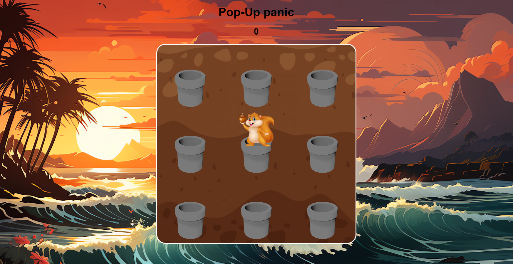
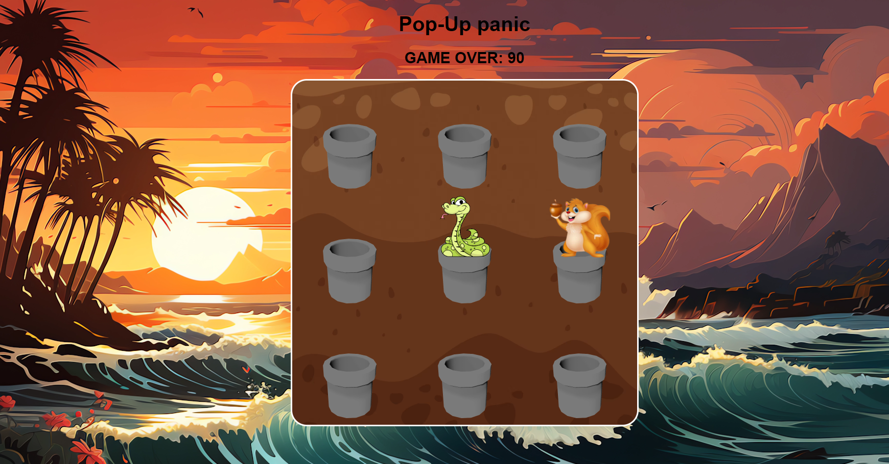

# Popup Panic

Popup Panic is a simple game inspired by Whac-A-Mole, where the player must click on squirrel to earn points. The game is built using HTML, CSS, and JavaScript.

## How to Play

- Click on the squirrel to earn points.
- Avoid clicking on the snake, as they will end the game.
- The game ends after a snake is clicked.

## Demo

You can play the game [here](https://sithumsankajith.github.io/pop-up-panic/).

## Technologies Used

- HTML
- CSS
- JavaScript

## License

This project is licensed under the MIT License - see the [LICENSE](LICENSE) file for details.
